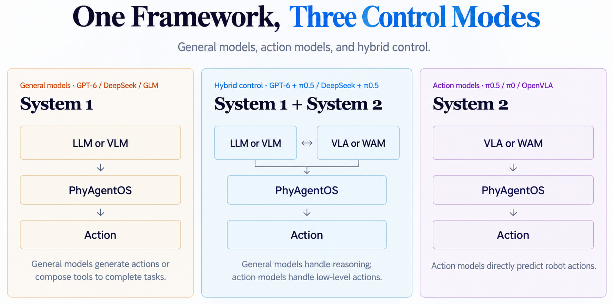
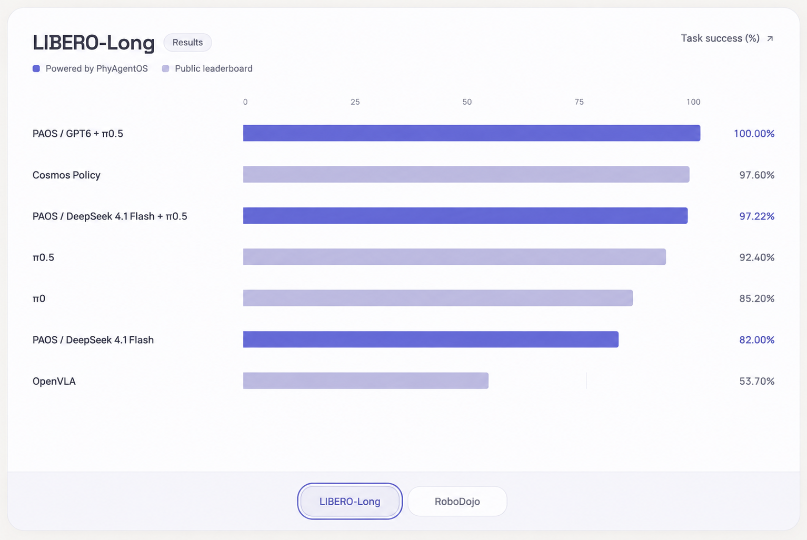
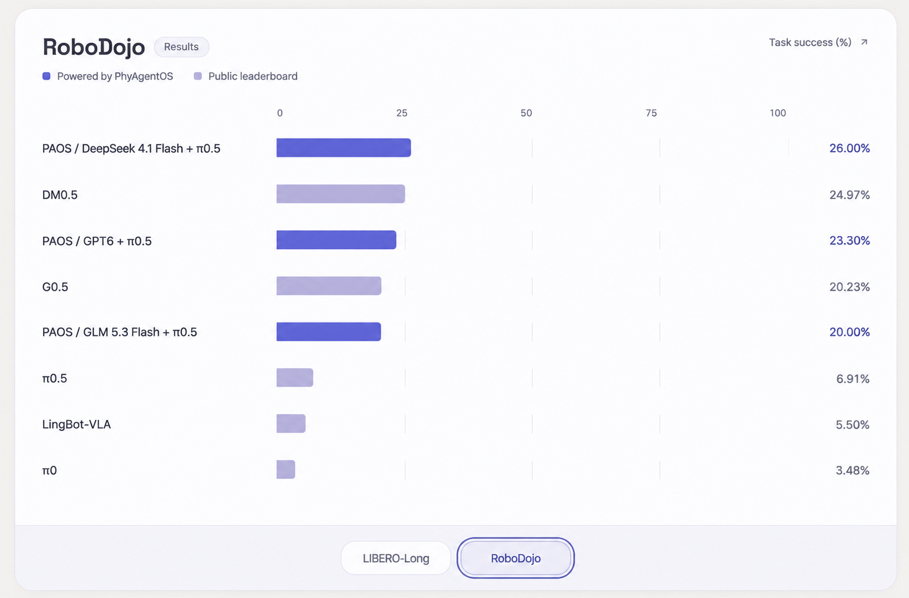

<div align="center">
  
  <h3>Recursive Self-Improvement Infrastructure for Physical Agents</h3>
  <p>
    <a href="https://arxiv.org/abs/2607.16636">Technical Report</a> ·
    <a href="https://phy-agent-os.net/">Website</a> ·
    <a href="docs/README.md">Documentation</a> ·
    <a href="https://discord.gg/YJztZ4wUM">Discord</a>
  </p>
  <p>
    <a href="LICENSE"></a>
    
    <a href="CHANGELOG.md"></a>
    <a href="https://github.com/PhyAgentOS/PhyAgentOS-core/stargazers"></a>
  </p>
  <p><a href="README.md">English</a> · <a href="README_zh.md">简体中文</a></p>
  <p>
    <a href="#what">What</a> ·
    <a href="#why">Why</a> ·
    <a href="#quick-start">Quick Start</a> ·
    <a href="#control-modes">Control Modes</a> ·
    <a href="#benchmarks">Benchmark</a> ·
    <a href="#robot-skills">Robot Skills</a> ·
    <a href="#documentation">Documentation</a>
  </p>
</div>

---

<a id="what"></a>
## What is PhyAgentOS?

**PhyAgentOS is a Recursive Self-Improvement (RSI) framework for embodied agents.** It connects cognitive planning, Physical Execution, and task verification in a runtime-wide feedback loop, improving Skills and Lessons from verified experience for future tasks.


<a id="why"></a>
## Why PhyAgentOS?

| Capability | What it enables |
| --- | --- |
| **One framework, multiple control modes** | Combine general-model reasoning, action models, or hybrid control through the capabilities exposed by an installed Skill. |
| **Verified task outcomes** | Evaluate goals against observations and execution facts, with bounded replanning when recovery is needed. |
| **Experience that improves future tasks** | Accumulate reusable workflows and scoped Lessons from verified experience, with guarded promotion and revision history. |
| **Reusable physical capabilities** | Package environment-specific tools and runtimes as versioned Skills, keeping cognitive planning separate from robot integration. |

<a id="quick-start"></a>
## Quickstart · How to get started

Start with a model-backed CLI conversation, then connect a robot or simulator Skill below. **Prerequisites:** Python 3.11 or 3.12, Git, and an API key for your model provider.

### 1. Install and initialize

```bash
git clone https://github.com/PhyAgentOS/PhyAgentOS-core.git
cd PhyAgentOS-core
python -m venv .venv
source .venv/bin/activate
python -m pip install -e .
paos onboard
```

On Windows PowerShell, replace the activation command with `.venv\Scripts\Activate.ps1`.

### 2. Connect a model


Configure credentials with hidden input, then select the default:

```bash
paos provider configure openrouter
paos provider use openrouter --model anthropic/claude-sonnet-4
```

See the [provider CLI guide](docs/en/02-user-manual.md#2-configure-the-model-and-forge) for
Docker/secret input, process overrides and session commands (`/provider`, `/model`, `/effort`, `/status`).
Session switches affect subsequent turns only and leave running tasks and other sessions unchanged.

<details>
<summary>Full configuration reference (from dev)</summary>

The configuration file is serialized in camelCase; snake_case keys are also accepted.

```json
{
  "agents": {
    "defaults": {
      "workspace": "~/.PhyAgentOS/workspace",
      "model": "openrouter/openai/gpt-4o-mini",
      "provider": "openrouter"
    },
    "verification": {
      "serviceEnabled": true,
      "evidenceRetention": "failed",
      "maxReplansPerEpisode": 2,
      "maxVerifierCallsPerRun": 50
    },
    "evolution": {
      "enabled": true,
      "scope": "verified_forge_lineage",
      "promotionMode": "guarded_auto",
      "minSuccessfulEpisodes": 3,
      "minLessonEpisodes": 3,
      "maxLessonsPerSkill": 8,
      "maxEvolutionCallsPerRun": 20
    }
  },
  "providers": {
    "openrouter": {
      "apiKey": "YOUR_API_KEY"
    }
  },
  "forge": {
    "requestTimeoutS": 10,
    "pollIntervalS": 0.5,
    "executionTimeoutS": 300,
    "evidence": {
      "requiredImageSources": ["front"],
      "captureTimeoutS": 5,
      "postCaptureTimeoutS": 5,
      "connectionTimeoutS": 2,
      "maxArtifactBytes": 8388608,
      "associationQuality": "best_effort"
    }
  },
  "resourceRegistry": {
    "url": "https://paos-resource-manager.dev.x-era.com"
  }
}
```

The `front` source is only an example. `resourceRegistry.url` selects a generic package registry;
it may be empty when all artifacts are installed from local bundles or a supplied static index.
PAOS connects only to the Gateway URL in the manifest of the explicitly started, healthy Skill
Runtime. It never starts or downloads a concrete Skill merely because the Agent starts.

</details>

### 3. Run your first request

```bash
paos status
paos agent -m "Hello! Introduce yourself."
paos agent
```

You should receive a model response; `paos agent` opens an interactive conversation. This checks the core Agent and provider connection. Physical execution additionally needs a running Skill Runtime.

Need another provider or deployment option? See the [user manual](docs/en/02-user-manual.md) · [Docker](docs/user_manual/DOCKER_en.md).

<a id="control-modes"></a>
## One framework, three control modes



System 1 / System 2 follow the supplied figure’s naming for general-model control and action-model control, respectively.

These describe integration patterns; model and environment availability depends on the installed Physical Execution Skill. Core does not bundle model weights, simulator assets, or robot drivers.

<a id="benchmarks"></a>
## Benchmark

Reported task success rates on **LIBERO-Long** and **RoboDojo**. Purple bars show PhyAgentOS (PAOS); muted bars show public-leaderboard references.





| PhyAgentOS configuration | LIBERO-Long ↑ | RoboDojo ↑ |
| --- | ---: | ---: |
| GPT6 + π0.5 | **100.00%** | 23.30% |
| DeepSeek 4.1 Flash + π0.5 | 97.22% | **26.00%** |
| GLM 5.3 Flash + π0.5 | — | 20.00% |
| DeepSeek 4.1 Flash | 82.00% | — |

> English-localized versions of the benchmark figures supplied by the maintainers; model names and reported values are preserved. See [full results and evaluation context](docs/benchmarks.md). “—” means not reported.

<a id="robot-skills"></a>
## Connect a robot or simulator

A **Physical Execution Skill** packages a workflow and its runtime requirements. Install the Skill for your environment, start one of its named profiles, then ask the Agent to use it.

**1. Install Dora for managed runtimes**

The v1.0.0 compatibility baseline is Dora CLI **0.4.1** (`dora-message` **0.7.0**). On Linux/macOS:

```bash
curl --proto '=https' --tlsv1.2 -LsSf \
  https://github.com/dora-rs/dora/releases/download/v0.4.1/dora-cli-installer.sh | sh
dora --version
```

Dora is needed for `paos skill start`; the CLI conversation above does not require it. [Windows and Cargo instructions](docs/en/02-user-manual.md#dora-cli-for-managed-skill-profiles).

**2. Find and install a Skill**

For registry downloads, set `resourceRegistry.url` in your config or export `PAOS_RESOURCE_REGISTRY_URL` to the registry supplied by your deployment. Then run:

```bash
paos skill search
paos skill install <skill-name> --version <version>
paos skill inspect <skill-name>
```

Replace `<skill-name>` and `<version>` with a search result. For an independently obtained local bundle:

```bash
paos skill install /path/to/skill-bundle.tar.gz --local
```

**3. Start the runtime and submit a task**

Replace `<profile>` with a profile declared by the installed Skill; follow its setup instructions for models, assets, and hardware.

```bash
paos skill start <skill-name> --profile <profile>
paos skill status <skill-name>
paos agent -m "Inspect the active Skill and Physical Execution capabilities, then report which tasks are available."
```

Once the runtime is healthy, describe a task supported by that Skill in `paos agent`. Starting the Agent does not automatically download or start a runtime.

<details>
<summary>Useful runtime commands</summary>

```bash
paos skill list
paos skill logs <skill-name>
paos skill stop <skill-name>
paos gateway
```

`paos gateway` runs configured message channels and background services. For readiness checks and troubleshooting, see the [operations guide](docs/user_manual/README_en.md).

Each Physical Execution Skill bundle declares its workflow document, required Tool IDs, named runtime profiles,
and exact platform/architecture Node locks. Each locked archive has an exact SHA-256 and contains
either one named root-level executable (`executable_tar_gz`) or one root directory named after the
entrypoint that holds the executable and its runtime tree (`directory_tar_gz`). For Registry Node
downloads, the verified Skill lock supplies the
digest when the Registry omits that duplicate field, and the exact size is resolved before the
download begins; installation records and verifies the extracted binary hash.
`python scripts/package_skill.py <bundle-dir> --output-dir <directory>` creates a deterministic
bundle for publication. The PhyAgentOS source and release packages do not
bundle concrete Physical Execution Skills, Physical Execution nodes, models, or simulation assets; obtain only the Skills
needed for a deployment and install them explicitly.
The [integration development guide](docs/user_development_guide/README_en.md#5-package-publish-and-close-the-local-loop)
documents Bundle layout, local validation, immutable publication order, and Registry acceptance.

</details>

<a id="documentation"></a>
## Documentation

| I want to… | Start here |
| --- | --- |
| Install, configure, and run PhyAgentOS | [User manual](docs/en/02-user-manual.md) |
| Build a Skill or connect an environment | [Integration guide](docs/user_development_guide/README_en.md) |
| Understand the Physical Execution API | [Physical Execution Tool API](docs/forge/README.md) |
| Develop and test Core | [Developer manual](docs/en/03-developer-manual.md) |
| Inspect benchmark values and provenance | [Benchmark](docs/benchmarks.md) |
| Browse all documentation | [Documentation index](docs/README.md) |

## News

| Version | Date | Update |
| --- | --- | --- |
| **v1.0.0** | 2026-08-30 | Initial stable release of PhyAgentOS. |
| **v0.2.3** | 2026-08-27 | Physical Execution Skills can be installed and managed independently, activated into immutable AgentTask bindings, and used through governed Query, Action, and Session Tool API lifecycles with recovery and version-scoped experience. |
| **v0.2.2** | 2026-08-21 | Unified Physical Execution execution on the Query/Action Tool API and added AgentTask aggregation, a verifiable Skill Runtime, Resource Registry integration, and the move-arm-by-ee Skill while retaining Agent verification and evolution. |

See the [full changelog](CHANGELOG.md).

## Contributing & community

Contributions are welcome: report a bug, improve a Skill, add an environment integration, or help with documentation. Start with the [developer manual](docs/en/03-developer-manual.md) and open an [issue](https://github.com/PhyAgentOS/PhyAgentOS-core/issues) or pull request.

<details>
<summary>Development checks</summary>

```bash
python -m pip install -e ".[dev]"
pytest
ruff check PhyAgentOS tests
python -m compileall -q PhyAgentOS tests
```

</details>

[Discord](https://discord.gg/YJztZ4wUM) · [X](https://x.com/phyagentos) · [Bilibili](https://space.bilibili.com/3546880296355920) · [LinkedIn](https://www.linkedin.com/in/phyagent-os-252372401/) · [Xiaohongshu](https://www.xiaohongshu.com/user/profile/673d83e3000000001c01a183)

## Citation & acknowledgements

If PhyAgentOS helps your research, please cite our [technical report](https://arxiv.org/abs/2607.16636).

```bibtex
@article{liu2026phyagentos,
  title={PhyAgentOS: A Self-Evolving Operating System for Embodied Agents with Decoupled Cognitive Planning and Physical Execution},
  author={Liu, Yang and Chen, Weixing and Song, Xinshuai and Pu, Tao and Mo, Siwen and Bai, Yongjie and Chen, Zihao and Sun, Qianran and Zhong, Liruo and Shen, Ying and others},
  journal={arXiv preprint arXiv:2607.16636},
  year={2026}
}
```

Thanks to the maintainers of MuJoCo, ROS, the open benchmark suites, and every contributor to PhyAgentOS.

---

<div align="center">
  <p>Jointly developed by <b>Sun Yat-sen University HCP Lab</b>, <b>Peng Cheng Laboratory</b>, and <b>X-Era Lab</b>.</p>
  &nbsp;&nbsp;
  &nbsp;&nbsp;
  
  <p><sub>MIT License · Copyright © 2025–2026 PhyAgentOS</sub></p>
</div>
