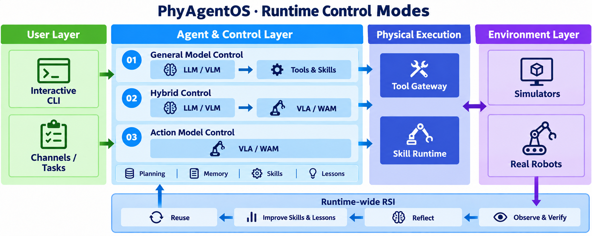
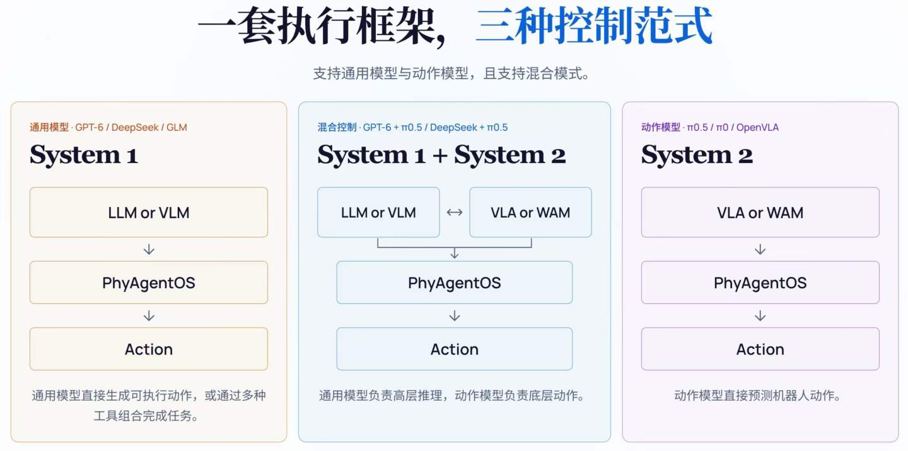

<div align="center">
  
  <h3>面向具身智能体的递归自进化基础设施</h3>
  <p>
    <a href="https://arxiv.org/abs/2607.16636">技术报告</a> ·
    <a href="https://phy-agent-os.net/">官网</a> ·
    <a href="docs/README.md">文档</a> ·
    <a href="https://discord.gg/YJztZ4wUM">Discord</a>
  </p>
  <p>
    <a href="LICENSE"></a>
    
    <a href="CHANGELOG.md"></a>
    <a href="https://github.com/PhyAgentOS/PhyAgentOS-core/stargazers"></a>
  </p>
  <p><a href="README.md">English</a> · <a href="README_zh.md">简体中文</a></p>
  <p>
    <a href="#what">What</a> ·
    <a href="#why">Why</a> ·
    <a href="#quick-start">快速开始</a> ·
    <a href="#quickstart-examples">快速启动示例</a> ·
    <a href="#control-modes">控制方式</a> ·
    <a href="#benchmarks">Benchmark</a> ·
    <a href="#robot-skills">运行机器人技能</a> ·
    <a href="#documentation">文档导航</a>
  </p>
</div>

---

<a id="what"></a>
## What · PhyAgentOS 是什么？

**PhyAgentOS 是面向具身智能体的递归自进化（RSI）框架。** 它将认知规划、Physical Execution 与任务验证连接为跨 Runtime 的反馈闭环，从经过验证的经验中改进 Skill 与 Lesson，并用于后续任务。



<a id="why"></a>
## Why · 为什么选择 PhyAgentOS？

| 核心能力 | 带来的价值 |
| --- | --- |
| **一套框架，多种控制方式** | 通过已安装 Skill 暴露的能力，接入通用模型、动作模型或混合控制。 |
| **以任务结果为准的验证** | 结合观测和执行事实判断目标是否达成，需要恢复时支持有预算的重新规划。 |
| **让经验改进后续任务** | 从经过验证的经验中积累可复用工作流与作用域 Lesson，并通过受控晋升和版本记录管理改进。 |
| **可复用的物理执行能力** | 将环境相关工具与 Runtime 封装为版本化 Skill，使认知规划与机器人接入保持解耦。 |

<a id="quick-start"></a>
## Quickstart · 如何开始使用

先运行模型驱动的 CLI 对话，再按下文接入机器人或仿真 Skill。**准备：** Python 3.11 或 3.12、Git，以及模型服务的 API Key。

### 1. 安装与初始化

```bash
git clone https://github.com/PhyAgentOS/PhyAgentOS-core.git
cd PhyAgentOS-core
python -m venv .venv
source .venv/bin/activate
python -m pip install -e .
paos onboard
```

Windows PowerShell 请将激活命令替换为 `.venv\Scripts\Activate.ps1`。

### 2. 配置模型


通过隐藏输入配置密钥，再选择默认 Provider：

```bash
paos provider configure openrouter
paos provider use openrouter --model anthropic/claude-sonnet-4
```

Docker/Secret 输入、进程启动覆盖和 `/provider`、`/model`、`/effort`、`/status` 会话命令见
[Provider CLI 指南](docs/zh/02-user-manual.md#2-配置模型与-forge)。会话切换只影响后续请求，
不改变正在执行的任务及其他会话。

<details>
<summary>完整配置参考（来自 dev）</summary>

配置保存为 camelCase，同时也接受 snake_case 输入。

```json
{
  "agents": {
    "defaults": {
      "workspace": "~/.PhyAgentOS/workspace",
      "model": "openrouter/openai/gpt-4o-mini",
      "provider": "openrouter"
    },
    "verification": {
      "serviceEnabled": true,
      "evidenceRetention": "failed",
      "maxReplansPerEpisode": 2,
      "maxVerifierCallsPerRun": 50
    },
    "evolution": {
      "enabled": true,
      "scope": "verified_forge_lineage",
      "promotionMode": "guarded_auto",
      "minSuccessfulEpisodes": 3,
      "minLessonEpisodes": 3,
      "maxLessonsPerSkill": 8,
      "maxEvolutionCallsPerRun": 20
    }
  },
  "providers": {
    "openrouter": {
      "apiKey": "YOUR_API_KEY"
    }
  },
  "forge": {
    "requestTimeoutS": 10,
    "pollIntervalS": 0.5,
    "executionTimeoutS": 300,
    "evidence": {
      "requiredImageSources": ["front"],
      "captureTimeoutS": 5,
      "postCaptureTimeoutS": 5,
      "connectionTimeoutS": 2,
      "maxArtifactBytes": 8388608,
      "associationQuality": "best_effort"
    }
  },
  "resourceRegistry": {
    "url": "https://paos-resource-manager.dev.x-era.com"
  }
}
```

`front` 只是示例。`resourceRegistry.url` 用于选择通用制品仓库；全部制品都从本地 Bundle
或显式静态 index 安装时可留空。PAOS 只连接到已显式启动且健康的 Skill Runtime manifest
所声明的 Gateway URL；启动 Agent 不会隐式启动或下载某个具体 Skill。

</details>

### 3. 运行第一条请求

```bash
paos status
paos agent -m "Hello! Introduce yourself."
paos agent
```

收到模型回复即完成核心 Agent 与模型服务的连通检查；`paos agent` 会打开交互式对话。执行物理任务还需要启动对应的 Skill Runtime。

其他模型服务与部署方式见 [用户手册](docs/zh/02-user-manual.md) · [Docker 部署](docs/user_manual/DOCKER.md).

<a id="control-modes"></a>
## 一套执行框架，三种控制方式



图中的 System 1 / System 2 沿用所提供原图的命名，分别指通用模型控制与动作模型控制。

以上描述的是接入方式；具体模型与环境取决于安装的 Physical Execution Skill。Core 不捆绑模型权重、仿真资源或机器人驱动。

<a id="benchmarks"></a>
## Benchmark

以下展示 **LIBERO-Long** 与 **RoboDojo** 上的任务成功率。深色为 PhyAgentOS（PAOS）结果，浅色为公开榜单参考值。


| PhyAgentOS 配置 | LIBERO-Long ↑ | RoboDojo ↑ |
| --- | ---: | ---: |
| GPT6 + π0.5 | **100.00%** | 23.30% |
| DeepSeek 4.1 Flash + π0.5 | 97.22% | **26.00%** |
| GLM 5.3 Flash + π0.5 | — | 20.00% |
| DeepSeek 4.1 Flash | 82.00% | — |

> 使用维护者提供的评测原图。完整数值与评测口径见 [Benchmark 说明](docs/benchmarks.md)；“—”表示未提供。复现 LIBERO 评测见 [LIBERO 快速启动](example/quickstart/libero-quickstart.md)。

<a id="robot-skills"></a>
## 接入机器人或仿真环境

**Physical Execution Skill** 封装工作流及其运行需求。安装环境对应的 Skill、启动其中一个命名 profile 后，即可让 Agent 使用它。

**1. 为托管 Runtime 安装 Dora**

v1.0.0 的兼容基线为 Dora CLI **0.4.1**（`dora-message` **0.7.0**）。Linux/macOS：

```bash
curl --proto '=https' --tlsv1.2 -LsSf \
  https://github.com/dora-rs/dora/releases/download/v0.4.1/dora-cli-installer.sh | sh
dora --version
```

`paos skill start` 需要 Dora，上面的 CLI 对话无需安装。[Windows 与 Cargo 安装说明](docs/zh/02-user-manual.md#托管-skill-profile-所需的-dora-cli)。

**2. 查找并安装 Skill**

从 Registry 下载时，在配置中设置 `resourceRegistry.url`，或将环境变量 `PAOS_RESOURCE_REGISTRY_URL` 指向部署方提供的 Registry，然后运行：

```bash
paos skill search
paos skill install <skill-name> --version <version>
paos skill inspect <skill-name>
```

将 `<skill-name>`、`<version>` 替换为搜索结果。也可以安装独立获取的本地 Bundle：

```bash
paos skill install /path/to/skill-bundle.tar.gz --local
```

**3. 启动 Runtime 并提交任务**

将 `<profile>` 替换为该 Skill 声明的 profile；模型、资源与硬件准备请遵循对应 Skill 的说明。

```bash
paos skill start <skill-name> --profile <profile>
paos skill status <skill-name>
paos agent -m "Inspect the active Skill and Physical Execution capabilities, then report which tasks are available."
```

Runtime 健康后，在 `paos agent` 中描述该 Skill 支持的任务。启动 Agent 不会自动下载或启动 Runtime。

<details>
<summary>常用运行管理命令</summary>

```bash
paos skill list
paos skill logs <skill-name>
paos skill stop <skill-name>
paos gateway
```

`paos gateway` 运行已配置的消息渠道与后台服务。就绪检查与排障见 [运行手册](docs/user_manual/README.md).

每个 Physical Execution Skill Bundle 声明工作流文档、所需 Tool ID、命名 Runtime profile，以及精确的
平台/架构 Node lock。每个锁定归档具有精确 SHA-256；`executable_tar_gz` 只包含一个指定文件名的
根目录可执行文件，`directory_tar_gz` 则只包含一个以 entrypoint 命名的根目录（同名可执行文件及
其运行时树置于其中）。安装时另行记录并校验解包后的 binary hash。
`python scripts/package_skill.py <bundle-dir> --output-dir <directory>` 可生成确定性发布 Bundle。
PhyAgentOS 源码与发布包不内置具体 Physical Execution Skill、Physical Execution node、模型或仿真资源；
部署者只需独立获取实际需要的 Skill 并显式安装。
[集成开发指南](docs/user_development_guide/README.md#5-打包发布与本地闭环)说明 Bundle 布局、
本地验证、不可变发布顺序与 Registry 验收。

</details>

<a id="quickstart-examples"></a>
## Quickstart · 快速启动示例

| 平台 | 内容 | 指南 |
| --- | --- | --- |
| Piper 机械臂 | Skill 安装、CAN 配置、真机启动与工具就绪验证 | [Piper 快速启动](example/quickstart/piper-quickstart.md) |
| LIBERO-10 仿真评测 | Skill/Node 安装、π0.5 权重、模型 API 配置与 50 集测评（π0.5 纯策略 / GPT-6 监督两条路线） | [LIBERO 快速启动](example/quickstart/libero-quickstart.md) |

<a id="documentation"></a>
## 文档导航

| 我想…… | 阅读入口 |
| --- | --- |
| 安装、配置并运行 PhyAgentOS | [用户手册](docs/zh/02-user-manual.md) |
| 开发 Skill 或接入新环境 | [集成开发指南](docs/user_development_guide/README.md) |
| 了解 Physical Execution API | [Physical Execution Tool API](docs/forge/README_zh.md) |
| 开发与测试 Core | [开发者手册](docs/zh/03-developer-manual.md) |
| 查看测评数值与来源 | [Benchmark](docs/benchmarks.md) |
| 浏览全部文档 | [文档索引](docs/README.md) |

## News · 最新动态

| 版本 | 日期 | 更新 |
| --- | --- | --- |
| **v1.0.0** | 2026-08-30 | Initial stable release of PhyAgentOS. |
| **v0.2.3** | 2026-08-27 | Physical Execution Skill 可独立安装和管理，经显式激活冻结到 AgentTask，并通过受治理的 Query、Action、Session Tool API 生命周期执行，支持恢复和按版本限定的经验。 |
| **v0.2.2** | 2026-08-21 | 将 Physical Execution 执行统一到 Query/Action Tool API，并增加 AgentTask 聚合、可校验 Skill Runtime、Resource Registry 接入和 move-arm-by-ee Skill，同时保留 Agent 验证与演化能力。 |

查看[完整更新记录](CHANGELOG.md)。

## 参与贡献与社区

欢迎报告问题、改进 Skill、接入新环境或完善文档。请先阅读[开发者手册](docs/zh/03-developer-manual.md)，再提交 [Issue](https://github.com/PhyAgentOS/PhyAgentOS-core/issues) 或 Pull Request。

<details>
<summary>开发检查命令</summary>

```bash
python -m pip install -e ".[dev]"
pytest
ruff check PhyAgentOS tests
python -m compileall -q PhyAgentOS tests
```

</details>

[Discord](https://discord.gg/YJztZ4wUM) · [X](https://x.com/phyagentos) · [Bilibili](https://space.bilibili.com/3546880296355920) · [LinkedIn](https://www.linkedin.com/in/phyagent-os-252372401/) · [小红书](https://www.xiaohongshu.com/user/profile/673d83e3000000001c01a183)

## 引用与致谢

如果 PhyAgentOS 对你的研究有帮助，欢迎引用我们的[技术报告](https://arxiv.org/abs/2607.16636)。

```bibtex
@article{liu2026phyagentos,
  title={PhyAgentOS: A Self-Evolving Operating System for Embodied Agents with Decoupled Cognitive Planning and Physical Execution},
  author={Liu, Yang and Chen, Weixing and Song, Xinshuai and Pu, Tao and Mo, Siwen and Bai, Yongjie and Chen, Zihao and Sun, Qianran and Zhong, Liruo and Shen, Ying and others},
  journal={arXiv preprint arXiv:2607.16636},
  year={2026}
}
```

感谢 MuJoCo、ROS、各开放基准的维护者，以及所有 PhyAgentOS 贡献者。

---

<div align="center">
  <p>由 <b>中山大学 HCP 实验室</b>、<b>鹏城实验室</b> 与 <b>拓元智慧</b> 联合开发。</p>
  &nbsp;&nbsp;
  &nbsp;&nbsp;
  
  <p><sub>MIT License · Copyright © 2025–2026 PhyAgentOS</sub></p>
</div>
