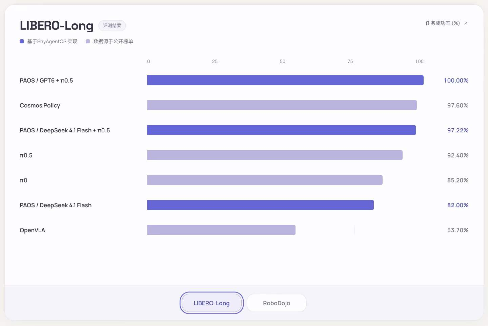
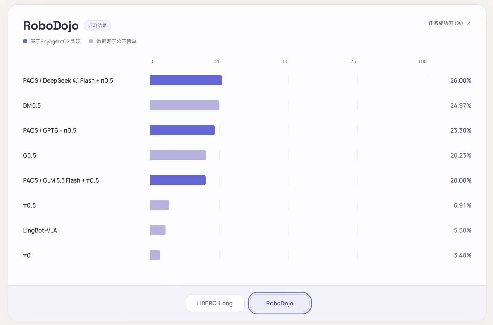

# Benchmark results / 测评结果

[English README](../README.md#benchmarks) · [中文 README](../README_zh.md#benchmarks)

These values were transcribed from the two benchmark screenshots supplied by the maintainer for the README redesign. PAOS entries are PhyAgentOS results; other entries are labeled in the screenshots as public-leaderboard data. Model names are preserved verbatim, including `GPT6`, `DM0.5`, and `G0.5`.

以下数值来自维护者为 README 改版提供的两张测评截图。PAOS 为 PhyAgentOS 结果，其余条目在原图中标注为公开榜单数据。模型名称按原图保留，包括 `GPT6`、`DM0.5` 和 `G0.5`。

**Metric / 指标:** task success rate (%) / 任务成功率，越高越好。

## LIBERO-Long

| Configuration / 配置 | Success / 成功率 | Source category / 来源类别 |
| --- | ---: | --- |
| PAOS / GPT6 + π0.5 | 100.00% | PhyAgentOS |
| Cosmos Policy | 97.60% | Public leaderboard / 公开榜单 |
| PAOS / DeepSeek 4.1 Flash + π0.5 | 97.22% | PhyAgentOS |
| π0.5 | 92.40% | Public leaderboard / 公开榜单 |
| π0 | 85.20% | Public leaderboard / 公开榜单 |
| PAOS / DeepSeek 4.1 Flash | 82.00% | PhyAgentOS |
| OpenVLA | 53.70% | Public leaderboard / 公开榜单 |

## RoboDojo

| Configuration / 配置 | Success / 成功率 | Source category / 来源类别 |
| --- | ---: | --- |
| PAOS / DeepSeek 4.1 Flash + π0.5 | 26.00% | PhyAgentOS |
| DM0.5 | 24.97% | Public leaderboard / 公开榜单 |
| PAOS / GPT6 + π0.5 | 23.30% | PhyAgentOS |
| G0.5 | 20.23% | Public leaderboard / 公开榜单 |
| PAOS / GLM 5.3 Flash + π0.5 | 20.00% | PhyAgentOS |
| π0.5 | 6.91% | Public leaderboard / 公开榜单 |
| LingBot-VLA | 5.50% | Public leaderboard / 公开榜单 |
| π0 | 3.48% | Public leaderboard / 公开榜单 |

## Evaluation context / 评测口径

The supplied screenshots do not specify evaluation dates, task subsets, episode counts, seeds, model checkpoint identifiers, compute budgets, reset/retry policies, or per-baseline source URLs. No raw run logs or reproducible evaluation commands accompanied them. Values are reported as supplied, not independently reproduced by this documentation change. Cross-method comparisons may use different evaluation protocols; no matched-protocol ranking or statistical significance is claimed.

截图未注明评测日期、任务子集、episode 数量、随机种子、模型 checkpoint、计算预算、重置/重试策略或各基线的原始来源链接，也未附原始日志和可复现命令。本次文档改版按所提供结果展示，没有独立复跑测评。不同方法可能采用不同评测协议，因此不声明同条件排名或统计显著性。

For a reproducible release, attach the exact Skill bundle/profile, Core revision, environment version, model configuration, evaluation command, episode-level logs, and the original baseline references to this page.

发布可复现结果时，请在本页补充精确的 Skill Bundle/profile、Core revision、环境版本、模型配置、评测命令、逐 episode 日志及基线原始引用。

## Image consistency / 图像一致性

The English figures preserve all 15 model/result pairs, ordering, and source categories from the supplied Chinese figures. Layout and typography were regenerated for translation; the numeric tables above are the exact-value reference. The control-mode figure uses `GPT-6`, while the benchmark source uses `GPT6`; source labels are retained and do not establish an exact model/checkpoint identity.

英文图保留中文原图全部 15 组模型与结果、排序和来源分类。翻译时重新生成了版式与文字，精确数值以上方表格为准。控制方式图写作 `GPT-6`，测评原图写作 `GPT6`；保留来源命名不代表已核实精确模型或 checkpoint 身份。
