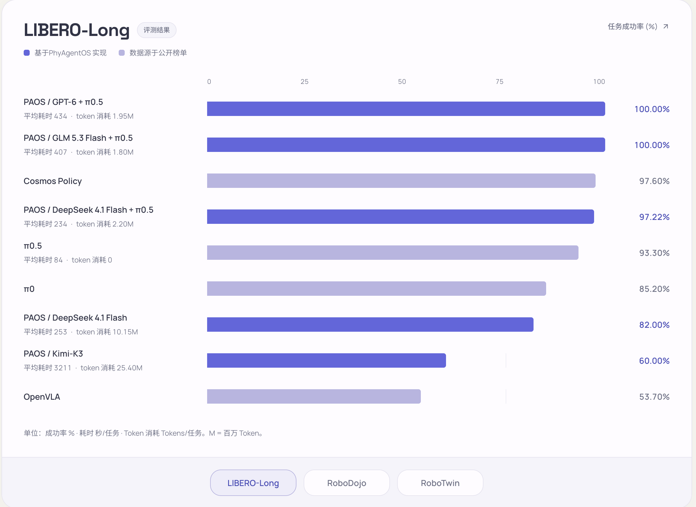
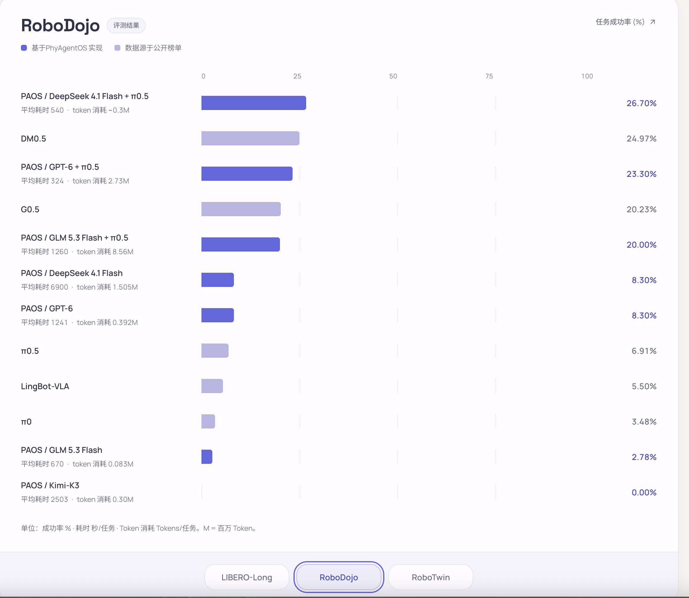
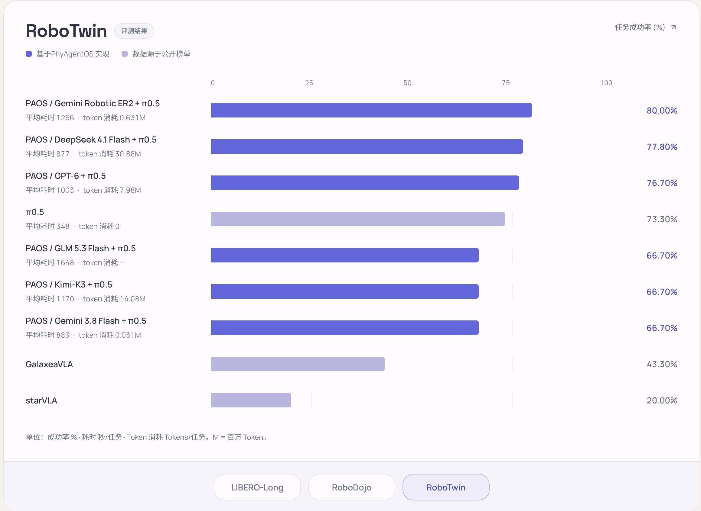

# Benchmark results / 测评结果

[English README](../README.md#benchmarks) · [中文 README](../README_zh.md#benchmarks)

Values are transcribed from the three latest benchmark screenshots supplied by the maintainer. Model labels, ordering, and source categories follow the figures. PAOS entries are PhyAgentOS results; muted entries are labeled as public-leaderboard references in the source figures.

以下数值来自维护者提供的最新三张评测截图，模型名称、顺序和来源分类按原图保留。PAOS 为 PhyAgentOS 结果，浅色条目在原图中标为公开榜单参考值。

**Units / 单位:** success rate (%) / 成功率；average time (seconds/task) / 平均耗时（秒/任务）；tokens (tokens/task) / Token 消耗（Tokens/任务）。M = million tokens / 百万 Token；“~” = approximate / 约；“—” = not reported / 未提供，不代表零。

## Evaluation context / 评测口径

| Benchmark | Task scope / 任务范围 |
| --- | --- |
| LIBERO | `libero-10` (labeled LIBERO-Long in the figures / 图中标为 LIBERO-Long) |
| RoboDojo | 10 randomly sampled tasks / 随机抽样 10 个任务 |
| RoboTwin | 10 randomly sampled tasks / 随机抽样 10 个任务 |

These task scopes were confirmed by the maintainer. Sample counts vary for some models; a uniform number of initial states or total episodes is not specified. Public-leaderboard references may use different protocols.

以上任务范围由维护者确认。部分模型采用不同的样本量，因此不统一声明初始状态数或总评测次数。公开榜单参考结果可能采用不同评测协议。

The supplied screenshots do not specify evaluation dates, exact sampled task IDs, per-model episode counts, seeds, model checkpoint identifiers, compute budgets, reset/retry policies, or per-baseline source URLs. No raw run logs or reproducible evaluation commands accompanied them. Values are reported as supplied, not independently reproduced by this documentation change. Cross-method comparisons may use different evaluation protocols; no matched-protocol ranking or statistical significance is claimed.

截图未注明评测日期、抽样任务的具体 ID、各模型的 episode 数量、随机种子、模型 checkpoint、计算预算、重置/重试策略或各基线的原始来源链接，也未附原始日志和可复现命令。本次文档改版按所提供结果展示，没有独立复跑测评。不同方法可能采用不同评测协议，因此不声明同条件排名或统计显著性。

For a reproducible release, attach the exact Skill bundle/profile, Core revision, environment version, model configuration, evaluation command, episode-level logs, and the original baseline references to this page.

发布可复现结果时，请在本页补充精确的 Skill Bundle/profile、Core revision、环境版本、模型配置、评测命令、逐 episode 日志及基线原始引用。

## LIBERO-Long

[English figure](imgs/benchmark-libero-long-en.png)

| Configuration / 配置 | Success / 成功率 | Time (s/task) / 耗时 | Tokens/task | Source / 来源 |
| --- | ---: | ---: | ---: | --- |
| PAOS / GPT-6 + π0.5 | 100.00% | 434 | 1.95M | PhyAgentOS |
| PAOS / GLM 5.3 Flash + π0.5 | 100.00% | 407 | 1.80M | PhyAgentOS |
| Cosmos Policy | 97.60% | — | — | Public leaderboard / 公开榜单 |
| PAOS / DeepSeek 4.1 Flash + π0.5 | 97.22% | 234 | 2.20M | PhyAgentOS |
| π0.5 | 93.30% | 84 | 0 | Public leaderboard / 公开榜单 |
| π0 | 85.20% | — | — | Public leaderboard / 公开榜单 |
| PAOS / DeepSeek 4.1 Flash | 82.00% | 253 | 10.15M | PhyAgentOS |
| PAOS / Kimi-K3 | 60.00% | 3211 | 25.40M | PhyAgentOS |
| OpenVLA | 53.70% | — | — | Public leaderboard / 公开榜单 |

## RoboDojo

[English figure](imgs/benchmark-robodojo-en.png)

| Configuration / 配置 | Success / 成功率 | Time (s/task) / 耗时 | Tokens/task | Source / 来源 |
| --- | ---: | ---: | ---: | --- |
| PAOS / DeepSeek 4.1 Flash + π0.5 | 26.70% | 540 | ~0.3M | PhyAgentOS |
| DM0.5 | 24.97% | — | — | Public leaderboard / 公开榜单 |
| PAOS / GPT-6 + π0.5 | 23.30% | 324 | 2.73M | PhyAgentOS |
| G0.5 | 20.23% | — | — | Public leaderboard / 公开榜单 |
| PAOS / GLM 5.3 Flash + π0.5 | 20.00% | 1260 | 8.56M | PhyAgentOS |
| PAOS / DeepSeek 4.1 Flash | 8.30% | 6900 | 1.505M | PhyAgentOS |
| PAOS / GPT-6 | 8.30% | 1241 | 0.392M | PhyAgentOS |
| π0.5 | 6.91% | — | — | Public leaderboard / 公开榜单 |
| LingBot-VLA | 5.50% | — | — | Public leaderboard / 公开榜单 |
| π0 | 3.48% | — | — | Public leaderboard / 公开榜单 |
| PAOS / GLM 5.3 Flash | 2.78% | 670 | 0.083M | PhyAgentOS |
| PAOS / Kimi-K3 | 0.00% | 2503 | 0.30M | PhyAgentOS |

## RoboTwin

[English figure](imgs/benchmark-robotwin-en.png)

| Configuration / 配置 | Success / 成功率 | Time (s/task) / 耗时 | Tokens/task | Source / 来源 |
| --- | ---: | ---: | ---: | --- |
| PAOS / Gemini Robotic ER2 + π0.5 | 80.00% | 1256 | 0.631M | PhyAgentOS |
| PAOS / DeepSeek 4.1 Flash + π0.5 | 77.80% | 877 | 30.88M | PhyAgentOS |
| PAOS / GPT-6 + π0.5 | 76.70% | 1003 | 7.98M | PhyAgentOS |
| π0.5 | 73.30% | 348 | 0 | Public leaderboard / 公开榜单 |
| PAOS / GLM 5.3 Flash + π0.5 | 66.70% | 1648 | — | PhyAgentOS |
| PAOS / Kimi-K3 + π0.5 | 66.70% | 1170 | 14.08M | PhyAgentOS |
| PAOS / Gemini 3.8 Flash + π0.5 | 66.70% | 883 | 0.031M | PhyAgentOS |
| GalaxeaVLA | 43.30% | — | — | Public leaderboard / 公开榜单 |
| starVLA | 20.00% | — | — | Public leaderboard / 公开榜单 |

## Image consistency / 图像一致性

The Chinese figures are unmodified originals. English figures translate the same 30 rows, preserving model labels, success rates, time and token values, ordering, and source categories. The tables above provide the exact-value reference; missing values are not treated as zero. Source labels do not establish exact model/checkpoint identities.

中文图使用未经修改的原图。英文图翻译相同的 30 条结果，保留模型名称、成功率、耗时、Token 消耗、顺序及来源分类。精确数值以上方表格为准，未提供的数值不视为零。来源命名不代表已核实精确模型或 checkpoint 身份。
