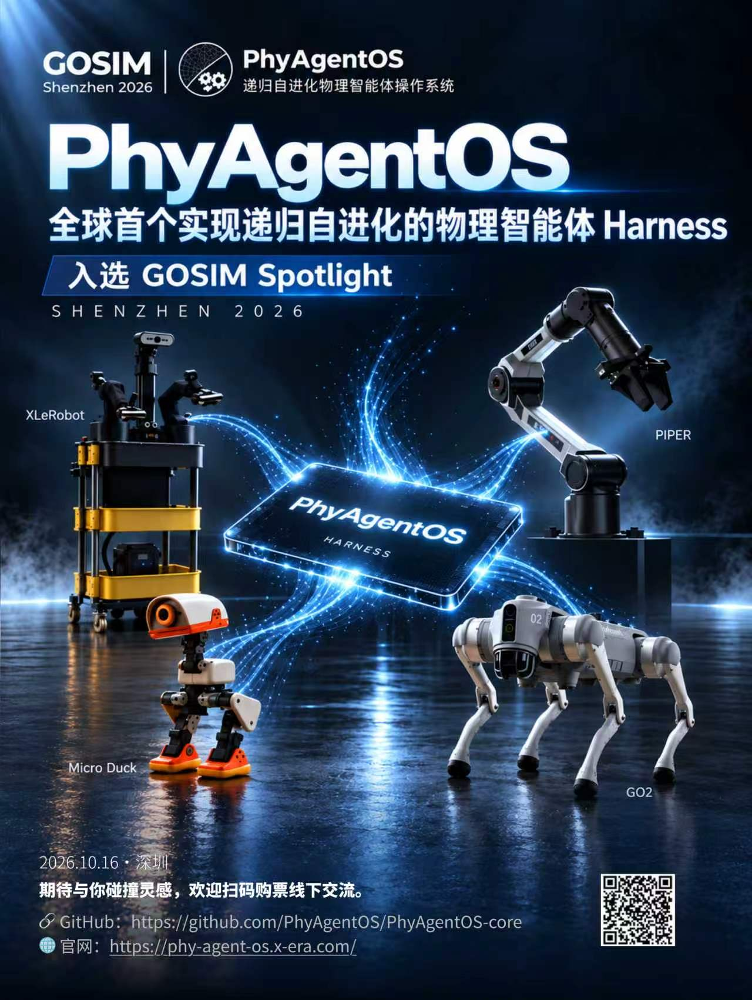

# 我们来了！GOSIM Spotlight × 开源机器人分论坛，现场见

[English](gosim-shenzhen-2026.md) · [简体中文](gosim-shenzhen-2026_zh.md) · [返回 README](../../README_zh.md#news)

**PhyAgentOS 正式入选 GOSIM Shenzhen 2026 Spotlight，并将在「开源机器人」分论坛做主题分享。** 10 月 16–17 日，欢迎来到深圳，与团队交流并观看 PhyAgentOS 现场 demo。

## Spotlight × 开源机器人

GOSIM Spotlight 是面向国际开源社区的项目展示计划，通过项目演讲和展示展台，让入选项目与开发者、合作伙伴及其他开源团队交流。PhyAgentOS 已列入[官方 Spotlight Shenzhen 2026 入选名单](https://spotlight.gosim.org/shenzhen2026/)。

PhyAgentOS 是支持递归自进化的开源物理智能体框架，将认知规划、Physical Execution 与任务验证连接起来，从经过验证的经验中积累可复用的 Skills 和 Lessons。我们希望让 Agent 从屏幕走向物理世界，将规划和工具调用能力带到真实机器人与仿真环境中。

## 现场分享信息

| 项目 | 信息 |
| --- | --- |
| 主题 | **《PhyAgentOS：递归自进化物理智能体操作系统》** |
| 讲者 | 蒲韬 / X-Era Lab 研发总监 |
| 分论坛 | 开源机器人 |
| 大会日期 | 2026 年 10 月 16–17 日 |
| 地点 | 深圳南山伊敦酒店 |
| 报告详情 | [官方报告页面](https://shenzhen2026.gosim.org/zh/schedule/p-158-phyagentos-%E9%80%92%E5%BD%92%E8%87%AA%E8%BF%9B%E5%8C%96%E7%89%A9%E7%90%86%E6%99%BA%E8%83%BD%E4%BD%93%E6%93%8D%E4%BD%9C%E7%B3%BB%E7%BB%9F/) |

欢迎到 Spotlight 展示现场观看 demo，与我们聊机器人、Agent 和具身智能。具体报告时段与会场请以官方报告页面的最新安排为准。

[大会官网](https://shenzhen2026.gosim.org/zh/) · [议程安排](https://shenzhen2026.gosim.org/zh/schedule/) · [购票入口](https://shenzhen2026.gosim.org/zh/tickets/)

## 活动海报

以下为团队提供的活动海报原图：

## 保持联系

[GitHub](https://github.com/PhyAgentOS/PhyAgentOS-core) · [PhyAgentOS 官网](https://phy-agent-os.x-era.com/)

欢迎 Star、Issue 和 PR，这是对开源项目最直接的支持。深圳现场见！
